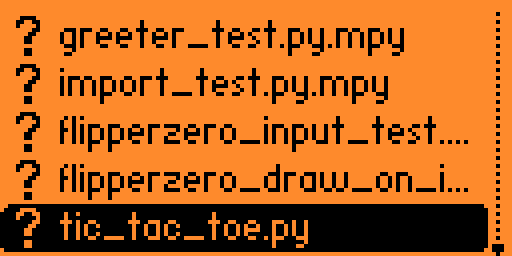

# MicroPython Flipper Zero

The application is now available on the official [Flipper Lab](https://lab.flipper.net/apps/upython).
For more information on how to programm your Flipper with Python, check out the [documentation](https://ofabel.github.io/mp-flipper/) on GitHub pages.

This branch contains the [FAP](https://developer.flipper.net/flipperzero/doxygen/apps_on_sd_card.html) version of the [MicroPython](https://micropython.org/) support for the famous [Flipper Zero](https://flipperzero.one/) gadget.
The results of the preceding research phase is still available in the [poc](https://github.com/ofabel/mp-flipper/tree/poc) branch.
The [lib](https://github.com/ofabel/mp-flipper/tree/lib) branch of this repository contains just the MicroPython library.
The progress of further research on what can be achieved when moving functionality to the firmware can be found in the [fork of the original firmware](https://github.com/ofabel/flipperzero-firmware/tree/ofa/micropython).

## Usage

Just place your Python files somewhere on the SD card (e.g. by using the [qFlipper](https://flipperzero.one/downloads) app).

The application just starts with an open file browser:



Here you can select any Python file to compile and execute from the SD card:


## Disclaimer

This FAP version requires about 80 kB from SRAM to start (needed for the Python runtime and compiler).
Due to memory fragmentation it's possible, that the application crashes when you start it.
If this happens, just try again (the crash doesn't harm your device).

Sadly, REPL support is only available in fhe [firmware fork](https://github.com/ofabel/flipperzero-firmware/tree/ofa/micropython) version.

## Setup and Build

This section is only relevant, if you want to build the FAP on your own.

### Requirements

* [Git](https://git-scm.com/)
* [Make](https://www.gnu.org/software/make/)
* [uFBT](https://pypi.org/project/ufbt/) available in your `PATH` (or you have to adjust the [Makefile](./Makefile))
* [Flipper Zero](https://flipperzero.one/)

### Setup

```bash
git clone --recurse-submodules git@github.com:ofabel/mp-flipper.git
```

### Build

Just open a terminal and run the Makefile targets:

```bash
make build
```

You can also build an launch the application on the attached Flipper Zero device in one command:

```bash
make launch
```
